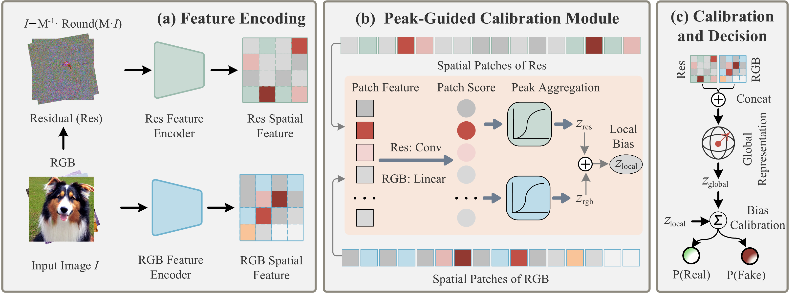

<div align="center">
<h1> PGC: Peak-Guided Calibration for Generalizable AI-Generated Image Detection</h1>

Xiaoyu Zhou<sup>1</sup>, Jianwei Fei<sup>2</sup>, Peipeng Yu<sup>1</sup>, Jingchang Xie<sup>3</sup>, Chong Cheng<sup>1</sup>, Zhihua Xia<sup>1✉</sup>

<sup>1</sup>College of Cyber Security, Jinan University, Guangzhou, China<br>
<sup>2</sup>Department of Information Engineering, University of Florence, Florence, Italy<br>
<sup>3</sup>School of Integrated Circuits, Guangdong University of Technology, Guangzhou, China<br>
</div>


## 🤖 Method / Architecture

<div style="text-align:center; margin:20px 0;">
    
    <br>
    <em>Overview of the Peak-Guided Calibration (PGC) Framework.</em>
</div>

## 📣 News

- 🎉 Our paper has been accepted by ICML 2026 !

---

## 🛠️ 1. Environment Setup
```bash
conda create -n pgc python=3.10 -y
conda activate pgc
pip install -r requirements.txt
```


## 📂 2. Datasets and Weights

Before starting training or evaluation, please download the required datasets, codebases, and model weights according to the following categories.

### 2.1 CommGen15 and Model Weights
The pre-trained models and evaluation dataset proposed in this paper have been officially released on ModelScope and Hugging Face:
- **CommGen15 Dataset**: [ModelScope-CommGen15](https://modelscope.cn/datasets/xiaoyuzhou68/CommGen15) and [HuggingFace-CommGen15](https://huggingface.co/datasets/xiaoyuzhou68/CommGen15)
- **PGC Pre-trained Model Collection (3 Checkpoints)**: [ModelScope-PGC_ckpt](https://modelscope.cn/models/xiaoyuzhou68/PGC_ckpt) and [HuggingFace-PGC_ckpt](https://huggingface.co/xiaoyuzhou68/PGC_ckpt)


### 2.2 Foundation Model and Evaluation Benchmarks
In addition to the data from this paper, you need to download the DINOv2 foundation model and open-source benchmark datasets for comprehensive comparison and experiments:
- **DINOv2-Large Pre-trained Weights**: [facebook/dinov2-large](https://huggingface.co/facebook/dinov2-large)
- **AIGI Benchmark**: [HorizonTEL/AIGIBench (GitHub)](https://github.com/HorizonTEL/AIGIBench)
- **GenImage Benchmark**: [GenImage-Dataset/GenImage (GitHub)](https://github.com/GenImage-Dataset/GenImage)
- **UniversalFakeDetect Benchmark**: [WisconsinAIVision/UniversalFakeDetect (GitHub)](https://github.com/WisconsinAIVision/UniversalFakeDetect)

### 2.3 Directory Structure

After downloading, please organize the corresponding models and datasets according to the following structure:

**Model Weights Directory:**
```text
<PROJECT_ROOT>/
├── pretrained_model/
│   ├── PGC_train_progan_ckpt.pth
│   ├── PGC_train_progan_sdv1_4_ckpt.pth
│   └── PGC_train_sdv1_4_ckpt.pth
└── pretrained_dino/
    └── dinov2-large/
        ├── config.json
        ├── model.safetensors
        └── ...
```

**Test Dataset Directory Structure:**
The test dataset must maintain the following directory format. The program will automatically read the real images (`0_real`, labeled as $0$) and fake images (`1_fake`, labeled as $1$):

```text
<DATA_ROOT>/GenImage/test/
├── ADM/
│   ├── 0_real/
│   └── 1_fake/
├── BigGAN/
│   ├── 0_real/
│   └── 1_fake/
├── glide/
│   ├── 0_real/
│   └── 1_fake/
├── Midjourney/
│   ├── 0_real/
│   └── 1_fake/
├── stable_diffusion_v_1_4/
│   ├── 0_real/
│   └── 1_fake/
├── stable_diffusion_v_1_5/
│   ├── 0_real/
│   └── 1_fake/
├── VQDM/
│   ├── 0_real/
│   └── 1_fake/
└── wukong/
    ├── 0_real/
    └── 1_fake/
```

## 🚀 3. Training Commands

The current training dataloader reads a Hugging Face `Dataset` / `DatasetDict`
from `--hf_dataset_path` or `--hf_dataset_repo`. Use `torchrun` for DDP; the
`--batch_size` value is per process/GPU.

### 3.0 DINOv3-Large DDP Training

```bash
torchrun --nproc_per_node=2 train.py \
  --name pgc_dinov3_large_ddp \
  --checkpoints_dir checkpoints \
  --devices 0,1 \
  --batch_size 16 \
  --dino_variant dinov3-large \
  --dino_pretrained_root <PROJECT_ROOT>/pretrained_dino \
  --hf_dataset_path <DATA_ROOT>/hf_real_fake__version_6 \
  --hf_train_split train \
  --hf_eval_split val \
  --test_root <DATA_ROOT>/UniversalFakeDetect/test \
  --cropSize 224 \
  --niter 100 \
  --lr 5e-5 \
  --optim adam \
  --accumulation_steps 4 \
  --weight_decay 0.05 \
  --label_smoothing 0.1 \
  --eval_every_steps 200
```

The older filesystem examples below are retained for reference, but the active
training path uses the Hugging Face dataset options above.

### 3.1 Training with the SDv1.4 Training Set

```bash
python train.py \
  --name pgc_train_sdv1_4 \
  --checkpoints_dir checkpoints \
  --devices 0 \
  --batch_size 32 \
  --dino_variant dinov2-large \
  --dino_pretrained_root <PROJECT_ROOT>/pretrained_dino \
  --lora_rank 8 \
  --lora_alpha 1.0 \
  --lora_dropout 0.1 \
  --real_image_dir <DATA_ROOT>/GenImage/stable_diffusion_v_1_4/imagenet_ai_0419_sdv4/train/nature \
  --fake_image_dir <DATA_ROOT>/GenImage/stable_diffusion_v_1_4/imagenet_ai_0419_sdv4/train/ai \
  --test_root <DATA_ROOT>/GenImage/test \
  --cropSize 224 \
  --niter 100 \
  --lr 5e-5 \
  --optim adam \
  --accumulation_steps 4 \
  --weight_decay 0.05 \
  --label_smoothing 0.1 \
  --tau_rgb 0.5 \
  --tau_res 0.5 \
  --eval_batch_size 32 \
  --eval_num_threads 8
```

### 3.2 Training with the ProGAN Training Set

```bash
python train.py \
  --name pgc_train_progan \
  --checkpoints_dir checkpoints \
  --devices 0 \
  --batch_size 32 \
  --dino_variant dinov2-large \
  --dino_pretrained_root <PROJECT_ROOT>/pretrained_dino \
  --lora_rank 8 \
  --lora_alpha 1.0 \
  --lora_dropout 0.1 \
  --real_image_dir <DATA_ROOT>/UniversalFakeDetect/train/0_real \
  --fake_image_dir <DATA_ROOT>/UniversalFakeDetect/train/1_fake \
  --test_root <DATA_ROOT>/UniversalFakeDetect/test \
  --cropSize 224 \
  --niter 100 \
  --lr 5e-5 \
  --optim adam \
  --accumulation_steps 4 \
  --weight_decay 0.05 \
  --label_smoothing 0.1 \
  --tau_rgb 0.5 \
  --tau_res 0.5 \
  --eval_batch_size 32 \
  --eval_num_threads 8
```

### 3.3 Joint Training with ProGAN + SDv1.4 Training Sets

```bash
python train.py \
  --name pgc_train_progan_sdv1_4 \
  --checkpoints_dir checkpoints \
  --devices 0 \
  --batch_size 32 \
  --dino_variant dinov2-large \
  --dino_pretrained_root <PROJECT_ROOT>/pretrained_dino \
  --lora_rank 8 \
  --lora_alpha 1.0 \
  --lora_dropout 0.1 \
  --real_image_dir \
    <DATA_ROOT>/GenImage/stable_diffusion_v_1_4/imagenet_ai_0419_sdv4/train/nature \
    <DATA_ROOT>/UniversalFakeDetect/train/0_real \
  --fake_image_dir \
    <DATA_ROOT>/GenImage/stable_diffusion_v_1_4/imagenet_ai_0419_sdv4/train/ai \
    <DATA_ROOT>/UniversalFakeDetect/train/1_fake \
  --test_root <DATA_ROOT>/AIGI/test \
  --cropSize 224 \
  --niter 100 \
  --lr 5e-5 \
  --optim adam \
  --accumulation_steps 4 \
  --weight_decay 0.05 \
  --label_smoothing 0.1 \
  --tau_rgb 0.5 \
  --tau_res 0.5 \
  --eval_batch_size 32 \
  --eval_num_threads 8
```

## 📊 4. Evaluation Commands

We provide corresponding evaluation scripts on different benchmarks:

### 4.1 GenImage Benchmark Evaluation

```bash
python test.py \
  --name test_GenImage \
  --checkpoint <PROJECT_ROOT>/pretrained_model/PGC_train_sdv1_4_ckpt.pth \
  --test_root <DATA_ROOT>/GenImage/test \
  --dino_variant dinov2-large \
  --dino_pretrained_root <PROJECT_ROOT>/pretrained_dino \
  --lora_rank 8 \
  --lora_alpha 1.0 \
  --devices 0 \
  --batch_size 32
```

### 4.2 CommGen15 Benchmark Evaluation

```bash
python test.py \
  --name test_CommGen15 \
  --checkpoint <PROJECT_ROOT>/pretrained_model/PGC_train_sdv1_4_ckpt.pth \
  --test_root <DATA_ROOT>/CommGen15 \
  --dino_variant dinov2-large \
  --dino_pretrained_root <PROJECT_ROOT>/pretrained_dino \
  --lora_rank 8 \
  --lora_alpha 1.0 \
  --devices 0 \
  --batch_size 32
```

### 4.3 UniversalFakeDetect Benchmark Evaluation

```bash
python test.py \
  --name test_UniversalFakeDetect \
  --checkpoint <PROJECT_ROOT>/pretrained_model/PGC_train_progan_ckpt.pth \
  --test_root <DATA_ROOT>/UniversalFakeDetect/test \
  --dino_variant dinov2-large \
  --dino_pretrained_root <PROJECT_ROOT>/pretrained_dino \
  --lora_rank 8 \
  --lora_alpha 1.0 \
  --devices 0 \
  --batch_size 32
```

### 4.4 AIGI Benchmark Evaluation

```bash
python test.py \
  --name test_AIGI \
  --checkpoint <PROJECT_ROOT>/pretrained_model/PGC_train_progan_sdv1_4_ckpt.pth \
  --test_root <DATA_ROOT>/AIGI/test \
  --dino_variant dinov2-large \
  --dino_pretrained_root <PROJECT_ROOT>/pretrained_dino \
  --lora_rank 8 \
  --lora_alpha 1.0 \
  --devices 0 \
  --batch_size 32
```


## ✍️ Citing
```
@inproceedings{zhou2026pgc,
  title={PGC: Peak-Guided Calibration for Generalizable AI-Generated Image Detection},
  author={Zhou, Xiaoyu and Fei, Jianwei and Yu, Peipeng and Xie, Jingchang and Cheng, Chong and Xia, Zhihua},
  journal={arXiv preprint arXiv:2605.21207},
  year={2026}
}
```
